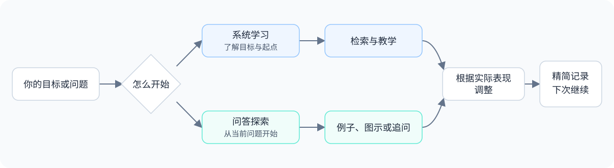

<div align="center">

# Adaptive Learning · 自适应学习

### 有目标，就一步步学。好奇了，就从一个问题开始。

为 AI Agent 准备的学习 Skill：查证资料、简短解释、练习反馈，接着上次继续。

[开始使用](#安装) · [使用教程](docs/getting-started.md) · [对话示例](examples/conversations.md) · [方法依据](skills/adaptive-learning/references/methods.md)

</div>

---

你可以带着明确目标来：**“我要能自己写 SQL 查询。”**

也可以只有一个问题：**“什么是 loop？”**

Adaptive Learning 会根据这两种情况调整教学方式。需要路线时，先了解目标与基础；只是好奇时，直接解释，等你继续追问。

## 两种方式，随时切换

| 系统学习 | 问答探索 |
| --- | --- |
| 从目标、基础和可用时间开始 | 从你眼前的问题开始 |
| 搜索资料，安排近期路径 | 查证后用短解释和例子回答 |
| 根据练习和作品给具体反馈 | 沿关键词继续追问，必要时用图示 |
| 保存进度、误区和下一步 | 只保留有续学价值的概念关系 |



## 安装

需要 Node.js 与 npm，以及支持 Agent Skills、网络搜索和本地文件读写的 Agent。Skill 本身是 Markdown 规则，不包含模型或搜索服务。

```bash
npx -y skills add time-dealer/adaptive-learning -g --all
```

只安装到 Codex：

```bash
npx -y skills add time-dealer/adaptive-learning -g -a codex -y
```

安装后打开新的 Agent 会话，输入：

```text
使用 $adaptive-learning，带我学习 SQL，目标是独立查询业务数据。
```

其他宿主的显式调用方式可能不同，也可以说“使用 adaptive-learning”。安装器来自 [vercel-labs/skills](https://github.com/vercel-labs/skills)。

### 卸载

移除全局安装的 Skill：

```bash
npx skills remove adaptive-learning -g
```

仅从 Codex 移除：

```bash
npx skills remove adaptive-learning -g -a codex
```

按提示确认移除范围。如果当初安装到项目内而没有使用 `-g`，在那个项目目录运行命令并去掉 `-g`。

**卸载只移除 Skill，不删除学习档案。** 独立学习库中的目标、进度、练习、作品、资料来源和本地路径配置都会保留。重新安装后，只要仍可访问原学习库，就可以继续读取记录。若要彻底清除记录，请自行核对学习库路径，另行备份或删除；不要为了卸载 Skill 删除整个文档目录。详见 [更新与卸载](docs/getting-started.md#5-更新和卸载)。

## 你可以这样说

```text
我想学自媒体写作，先了解我的基础，再帮我安排学习。
什么是 token？用简单例子解释，先别讲太多。
用流程图解释循环什么时候继续、什么时候停止。
这篇文章是给初学者看的，帮我分析结构和可读性。
上次那道题跳过，我们继续。
继续上次学习。
```

简单概念默认约 100～250 个中文字。图示、动画和小交互按理解需要选用；实际形式取决于宿主工具，无法交互时使用静态示意。

## 它怎么判断你学到了什么

SQL 看结果是否满足需求；文章看受众、结构、表达和具体修改取舍。开放成果不强制给一个“通过／不通过”。看过、跟着做过、独立完成和隔时仍会，会分别记录。

学习方法按需使用：主动回忆、间隔复习、样例学习、逐步减少帮助、交错练习、自我解释和迁移练习。研究支持的是这些具体机制，不代表本 Skill 的整体效果已经经过实验验证。[查看方法与来源](skills/adaptive-learning/references/methods.md)。

## 进度存在你自己的学习库

持续学习时，Agent 在本地保存目标、必要练习证据、误区和下一步。默认入口位于用户文档目录的 `Codex/learning-records`，也可以指定自己的目录。

```text
把我的学习档案保存在我指定的学习目录，以后从这里继续。
```

记录不包含全部对话或整篇搜索资料。跨会话恢复需要访问同一个目录；跨设备请自行同步档案。模型服务如何处理对话与文件，取决于你使用的 Agent 和服务商。

## 当前状态

首个公开试用版本。结构校验与本机全局入口检查已完成；完整多轮教学、跨会话恢复及长期学习效果尚未验证。仓库中的对话为教学示例，不是学习效果证明。安装验证记录见 [验证说明](docs/validation.md)。

## 继续了解

- [第一次学习、问答探索、保存与恢复](docs/getting-started.md)
- [示例：SQL、概念解释与写作反馈](examples/conversations.md)
- [反馈问题与参与改进](CONTRIBUTING.md)
- [版本记录](CHANGELOG.md)

## 许可与致谢

本仓库原创内容采用 [MIT License](LICENSE)。引用资料的权利归原作者所有，链接不改变其许可。

制作流程参考 dbskill 的 [dbs-skill-maker](https://github.com/dontbesilent2025/dbskill)，安装使用开源 Skills CLI。项目介绍方式参考 [Cyber Xiaowan](https://github.com/cyberxiaowan/cyber-xiaowan) 与 [Cheat on Content](https://github.com/XBuilderLAB/cheat-on-content)；本项目独立编写，不代表这些项目背书。
