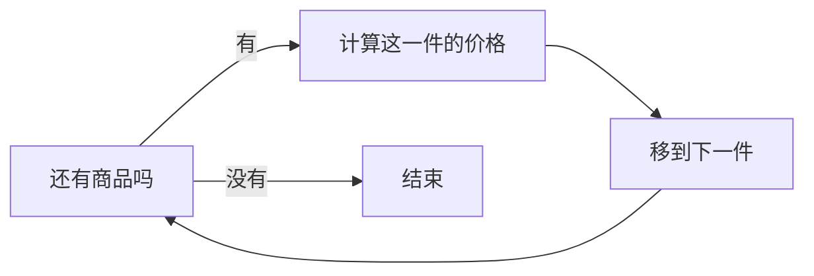

# 对话示例

以下是编写的教学示例，用于展示交互设计，不是实测对话或效果承诺。实际回答会随用户基础和工具能力调整。

## 概念探索：循环

**用户：**什么是 loop？

**助手：**在编程里，loop 就是循环：按规则重复执行一段操作，直到次数用完或条件不再满足。例如依次给购物清单上的每件商品计算价格，就是对每件商品重复同一个步骤。

**用户：**那 Agent loop 呢？

**助手：**可以先把它理解为 Agent 反复执行“判断下一步 → 调用工具 → 读取结果”的过程。它与普通循环都包含重复和停止条件，但每轮做什么可能由模型结合结果决定。具体停止规则由实现设置。

相关资料：[Python 循环](https://docs.python.org/3/tutorial/controlflow.html)、[Anthropic 的 Agent 工作流说明](https://www.anthropic.com/research/building-effective-agents)。

## 系统学习：SQL

**用户：**我想自己查订单数据，会一点 Excel。

**助手：**先围绕订单查询来学。你使用哪种数据库？通常想查询什么结果？

**用户：**SQLite，我想查金额超过 100 的订单。

**助手：**本节先学习筛选。假设表名为 `orders`，金额字段为 `amount`，筛选大于 100 的记录使用 `WHERE amount > 100`。现在换一道题：找出金额至少为 200 的订单，你会怎么写？

这里应等待用户回答。后续需检查结果意图及边界；没有运行环境时不能宣称执行通过。教学示例依据 [SQLite SELECT 文档](https://www.sqlite.org/lang_select.html)。

## 开放成果：写作

**用户：**这篇是给刚开始工作的人看的，想写得像聊天。

**助手的反馈方向：**指出具体段落是否围绕读者的问题展开，哪些抽象句可以替换成场景，哪里衔接跳跃；解释修改的效果与取舍。不会要求所有文章都套同一结构，也不会因口语表达而扣一个统一分数。

## 跳过与恢复

**用户：**这道题先跳过。

**助手：**继续后面的内容，并把该题记为跳过、未检验。

**新会话：**使用 adaptive-learning，继续上次学习。

**预期行为：**先读取可访问的学习库，恢复指定领域；找不到档案就请求路径，不虚构进度。
